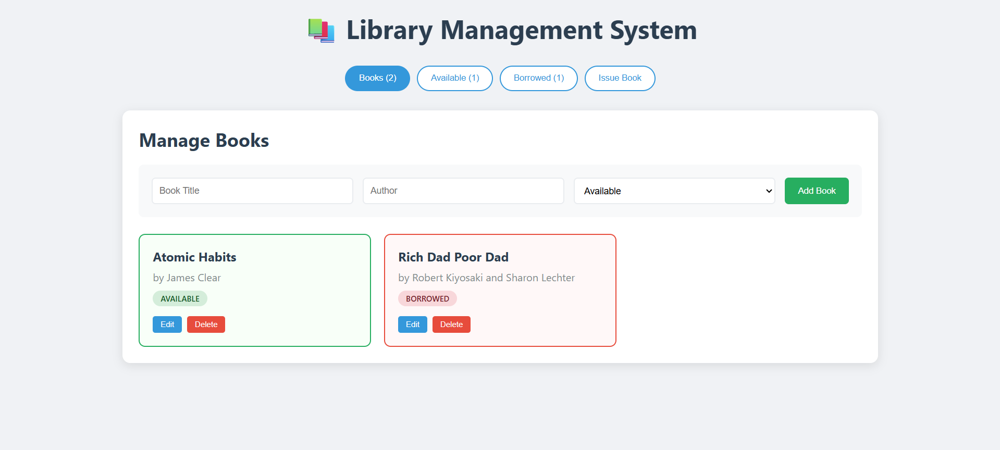

# 📚 Library Management System

A modern, full-stack library management system built with React and Node.js for efficient book and borrower tracking.

## 📸 Preview



## 🚀 Features

- **📖 Book Management**: Add, edit, delete, and track book inventory
- **👥 Borrower Management**: Issue books to borrowers and process returns
- **📊 Real-time Status**: Live updates of book availability
- **🎨 Responsive Design**: Works seamlessly on desktop and mobile
- **📈 Dashboard Views**: Multiple views for different operations

## 🛠️ Tech Stack

**Frontend:**
- React 19.1.1
- CSS3
- JavaScript ES6+

**Backend:**
- Node.js
- Express.js
- MySQL2

**Development:**
- Nodemon
- Concurrently

## 📋 Prerequisites

- Node.js (v14 or higher)
- MySQL Server
- npm or yarn

## ⚡ Quick Start

### 1. Clone the repository
```bash
git clone <repository-url>
cd library-management
```

### 2. Database Setup
```sql
-- Run in MySQL
CREATE DATABASE library_db;
USE library_db;

CREATE TABLE books (
  id INT AUTO_INCREMENT PRIMARY KEY,
  title VARCHAR(255) NOT NULL,
  author VARCHAR(255) NOT NULL,
  status ENUM('available', 'borrowed') DEFAULT 'available'
);

CREATE TABLE borrowers (
  id INT AUTO_INCREMENT PRIMARY KEY,
  name VARCHAR(255) NOT NULL,
  book_id INT NOT NULL,
  issue_date DATETIME DEFAULT CURRENT_TIMESTAMP,
  return_date DATETIME NULL,
  FOREIGN KEY (book_id) REFERENCES books(id) ON DELETE CASCADE
);
```

### 3. Install Dependencies
```bash
# Install root dependencies
npm install

# Install backend dependencies
cd backend && npm install

# Install frontend dependencies
cd ../frontend && npm install
```

### 4. Configure Database
Update database credentials in `backend/server.js`:
```javascript
const db = mysql.createConnection({
  host: 'localhost',
  user: 'your_username',
  password: 'your_password',
  database: 'library_db'
});
```

### 5. Run the Application


# Terminal 1 - Frontend
cd frontend
npm install
npm start

# Terminal 2 - Backend
cd backend
npm install
npm start
```

```

## 📡 API Endpoints

### Books
| Method | Endpoint | Description |
|--------|----------|-------------|
| GET | `/api/books` | Get all books |
| POST | `/api/books` | Add new book |
| PUT | `/api/books/:id` | Update book |
| DELETE | `/api/books/:id` | Delete book |

### Borrowers
| Method | Endpoint | Description |
|--------|----------|-------------|
| GET | `/api/borrowers` | Get all borrowing records |
| POST | `/api/borrowers` | Issue book to borrower |
| PUT | `/api/borrowers/:id/return` | Return book |

## 🗄️ Database Schema

### Books Table
```sql
id          INT AUTO_INCREMENT PRIMARY KEY
title       VARCHAR(255) NOT NULL
author      VARCHAR(255) NOT NULL
status      ENUM('available', 'borrowed') DEFAULT 'available'
```

### Borrowers Table
```sql
id          INT AUTO_INCREMENT PRIMARY KEY
name        VARCHAR(255) NOT NULL
book_id     INT NOT NULL (Foreign Key)
issue_date  DATETIME DEFAULT CURRENT_TIMESTAMP
return_date DATETIME NULL
```

## 🎯 Usage

### Adding Books
1. Navigate to "Books" tab
2. Fill in title, author, and status
3. Click "Add Book"

### Issuing Books
1. Go to "Issue Book" tab
2. Enter borrower name
3. Select available book
4. Click "Issue Book"

### Returning Books
1. Navigate to "Borrowed" tab
2. Find the borrowed book
3. Click "Return Book"

## 📁 Project Structure

```
library-management/
├── backend/
│   ├── server.js          # Express server
│   ├── database.sql       # Database schema
│   └── package.json       # Backend dependencies
├── frontend/
│   ├── src/
│   │   ├── App.js         # Main React component
│   │   ├── App.css        # Styles
│   │   └── index.js       # Entry point
│   └── package.json       # Frontend dependencies
├── package.json           # Root package.json
└── README.md
```

## 🤝 Contributing

1. Fork the repository
2. Create your feature branch (`git checkout -b feature/AmazingFeature`)
3. Commit your changes (`git commit -m 'Add some AmazingFeature'`)
4. Push to the branch (`git push origin feature/AmazingFeature`)
5. Open a Pull Request

## 📝 License

This project is licensed under the MIT License - see the [LICENSE](LICENSE) file for details.

## 🐛 Issues

If you encounter any issues, please [create an issue](../../issues) on GitHub.

## 📞 Support

For support, email your-email@example.com or create an issue in this repository.